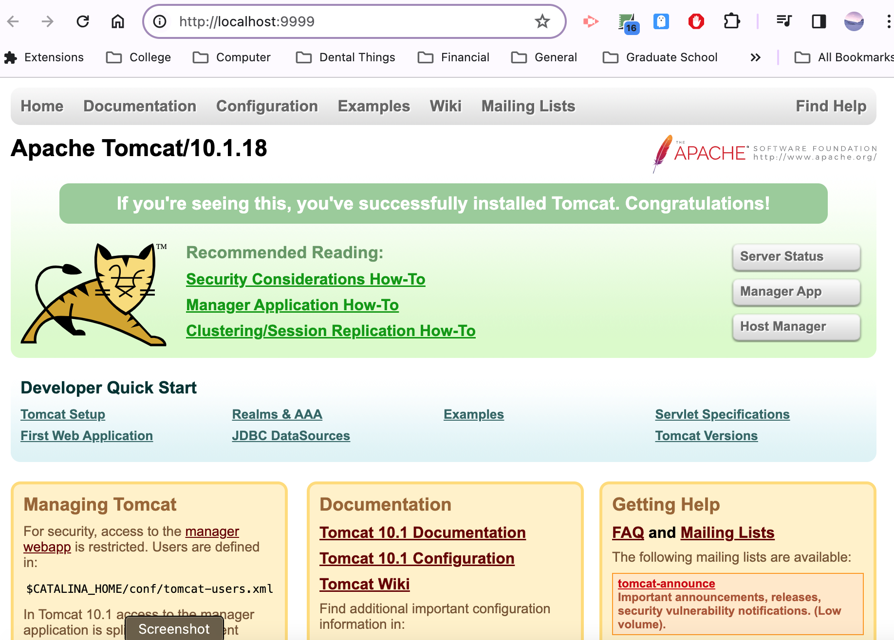

> **NOTE:** This README.md file should be placed at the **root of each of your repos directories.**
>
>Also, this file **must** use Markdown syntax, and provide project documentation as per below--otherwise, points **will** be deducted.
>

# LIS 4368

## Kalecia McNeal

### Assignment 1 Requirements:

*Sub-Heading:*

1. Distributed Version Control with Git and BitBucket Development 
2. Development Installation 
3. A1 Questions (Ch 1 through 4) 
4. BitBucket repo links 
a) the assignment 
b) the completed tutorial 

#### README.md file should include the following items:

* Bullet-list items
* Screenshot of running java Hello 
* Screenshot of running http://localhost:9999
* Screenshot of a1/index.jsp

> This is a blockquote.
> 
> This is the second paragraph in the blockquote.
>
> #### Git commands w/short descriptions:

1. git init - Creates a new repository 
2. git status - Allows you to see the status of commits and changes
3. git add - Allows you to add changes in your working directory
4. git commit - Allows you to save changes to the local repository
5. git push - Allows you to upload work from the local to the remote repository
6. git remote add origin- Allows you to add repositories 
7. git pull - Allows to download or get content from the remote repository to update the local repo in your system to match it 

#### Assignment Screenshots:

*Screenshot of running java Hello*:

*Screenshot of running http://localhost:9999*:

*Screenshot of A1/index.jsp- My First App*:

#### Tutorial Links:

*Bitbucket Tutorial - Station Locations:*
[A1 Bitbucket Station Locations Tutorial Link](https://Apples24824@bitbucket.org/my-web-portfolio/bitbucketstationlocations.git "Bitbucket Station Locations")

*Tutorial: Request to update a teammate's repository:*
[A1 My Team Quotes Tutorial Link](https://bitbucket.org/username/myteamquotes/ "My Team Quotes Tutorial")
