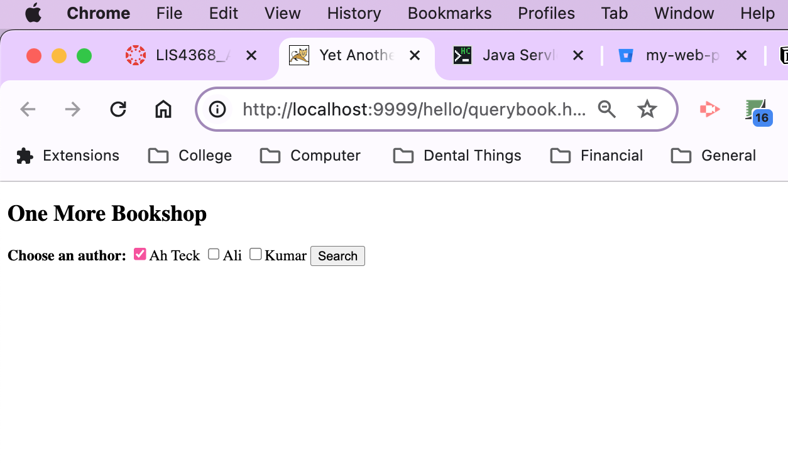
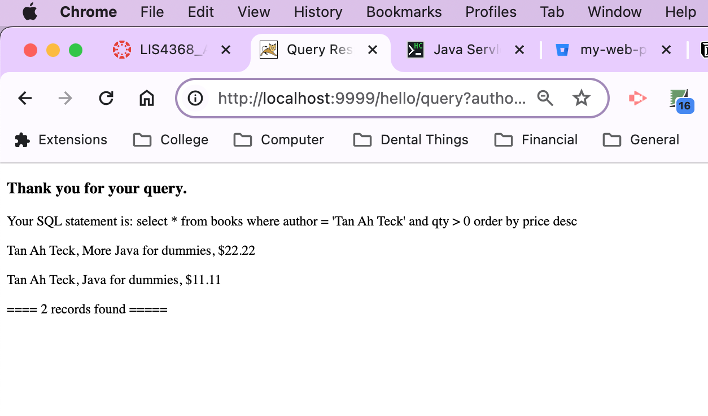
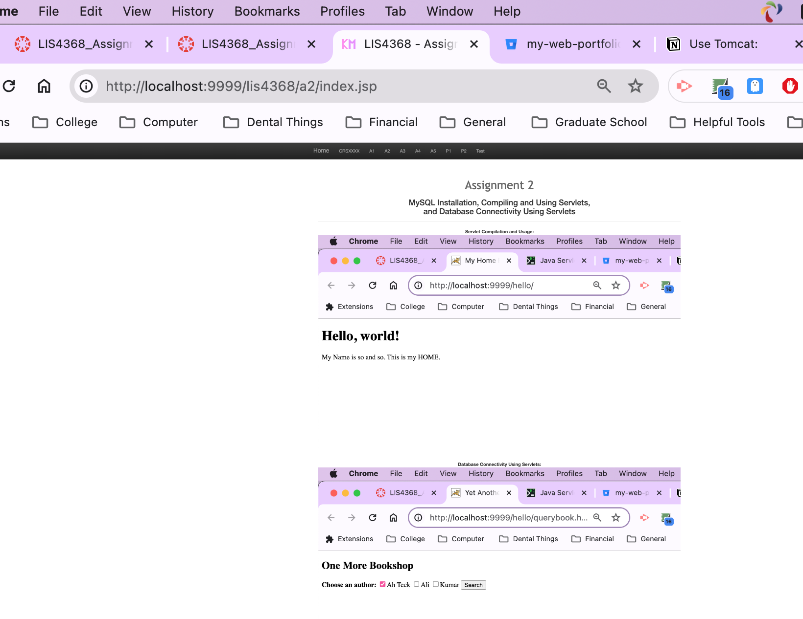

> **NOTE:** This README.md file should be placed at the **root of each of your repos directories.**
>
>Also, this file **must** use Markdown syntax, and provide project documentation as per below--otherwise, points **will** be deducted.
>

# LIS 4368

## Kalecia McNeal

### Assignment 2 Requirements:

*This includes:*

1. Development Environment (MySQL Workbench)
2. Finish Tomcat Tutorial 
3. Provide screenshots of required links 
4. Answer questions from Ch 5 and 6. 

#### README.md file should include the following items:

* Screenshot of running querybook.html
* Screenshot of running query results 
* Screenshot of a2/index.jsp

#### Assignment Screenshots:

*Screenshot of running http://localhost:9999/hello/querybook.html*:

*Screenshot of running query results*: 

*Screenshot of A2/index.jsp- My First App*:

#### Links:

*Bitbucket Tutorial - Station Locations:*
[Bitbucket Station Locations Link](https://Apples24824@bitbucket.org/my-web-portfolio/bitbucketstationlocations.git "Bitbucket Station Locations")