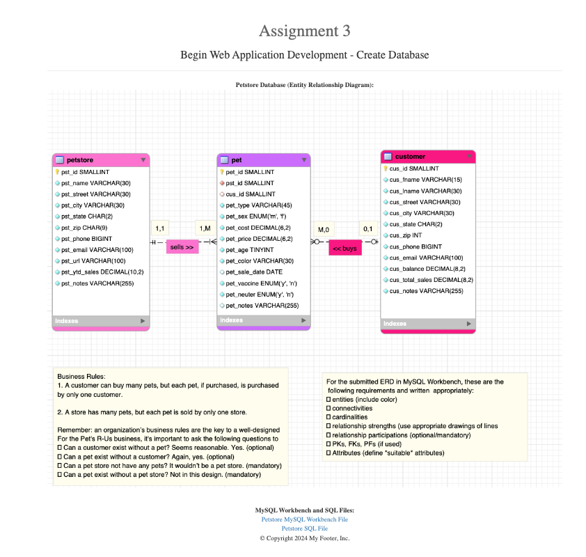
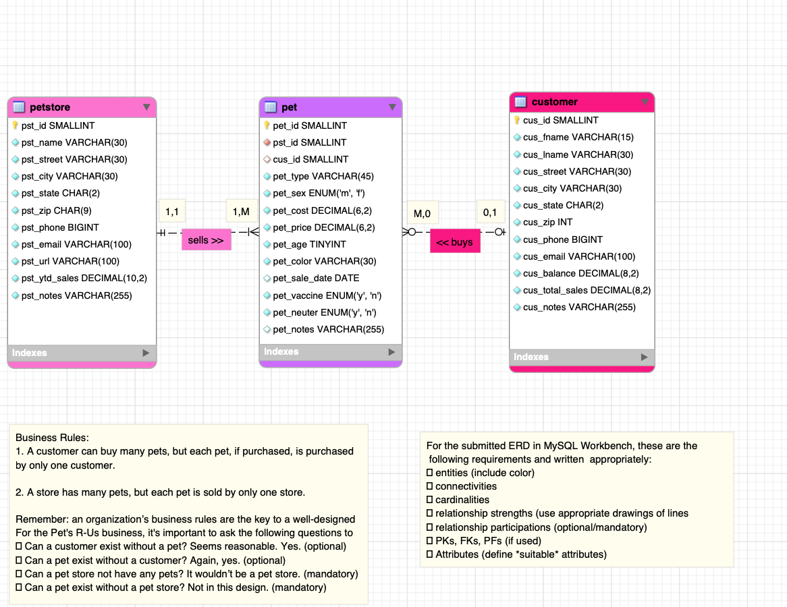

> **NOTE:** This README.md file should be placed at the **root of each of your repos directories.**
>
>Also, this file **must** use Markdown syntax, and provide project documentation as per below--otherwise, points **will** be deducted.
>

# LIS 4368

## Kalecia McNeal

### Assignment 3 Requirements:

*This includes:*

1. Database Requirement (MySQL Workbench)
2. Provide screenshots of required links 
3. Answer questions from Ch 7 and 8. 

#### README.md file should include the following items:

* Screenshot of ERD
* Screenshot of 10 records for each table using select * from each table
* Screenshot of a3/index.jsp
* Links to a3.mwb and a3.sql that download when clicked

#### Assignment Screenshot and Links:

*Screenshot A3 index.jsp*

*Screenshot A3 ERD*:

*A3 docs: a3.mwb and a3.sql*:

[A3 MWB File](docs/a3.mwb "A3 ERD in .mwb format")

[A3 SQL File](docs/a3.sql "A3 SQL Script")
