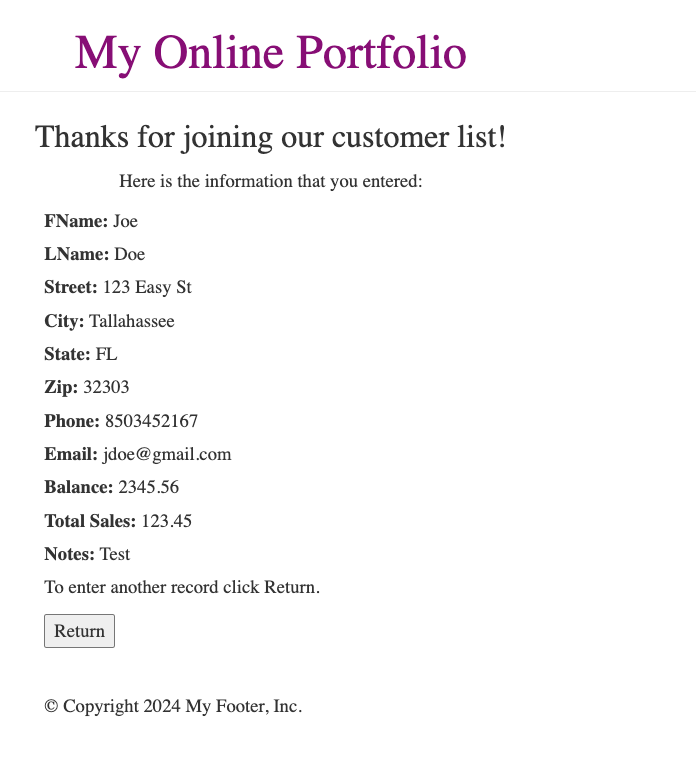
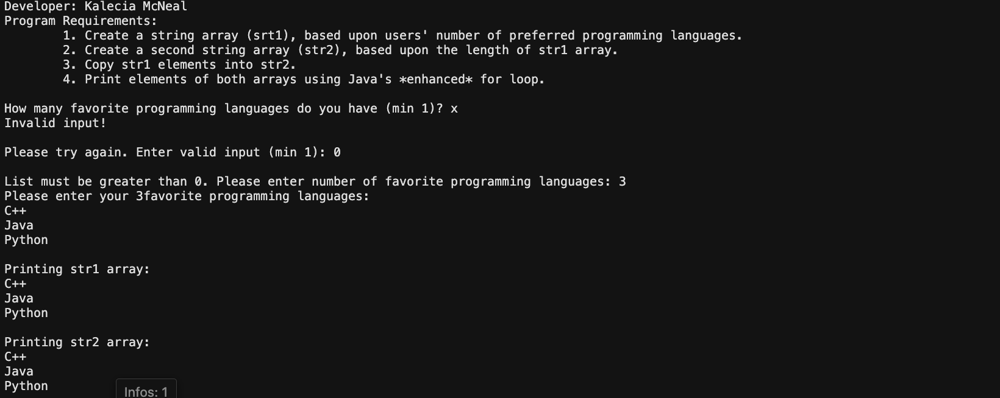

> **NOTE:** This README.md file should be placed at the **root of each of your repos directories.**
>
>Also, this file **must** use Markdown syntax, and provide project documentation as per below--otherwise, points **will** be deducted.
>

# LIS 4368

## Kalecia McNeal

### Assignment 4 Requirements:

*This includes:*

1. Fix validation for required index.jsp
2. Edit README.md
3. Provide required screenshots 
4. Answer questions from Ch 11 and 12. 

#### README.md file should include the following items:

* Screenshot of failed validation
* Screenshot of passed validation
* Screenshot of skillsets

#### Assignment Screenshot and Links:

*Screenshot of failed validation*:

*Screenshot of passed validation*:

*Screenshot of skillsets*:

*Screenshot of Q10*:

*Screenshot of Q11*:

*Screenshot of Q12*:

 
#### Links:

*Bitbucket Tutorial - Station Locations:*
[Bitbucket Station Locations Link](https://Apples24824@bitbucket.org/my-web-portfolio/bitbucketstationlocations.git "Bitbucket Station Locations")

*Regular Expressions*: 
[Lesson 7 - Regular Expressions](http://www.qcitr.com/usefullinks.htm#lesson7 "Dr. Jowett's Regular Expressions")