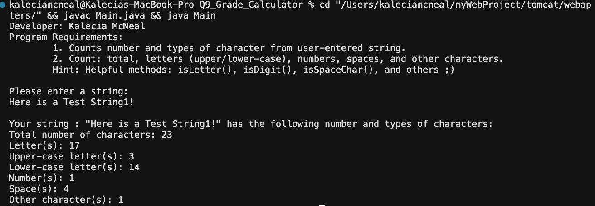

> **NOTE:** This README.md file should be placed at the **root of each of your repos directories.**
>
>Also, this file **must** use Markdown syntax, and provide project documentation as per below--otherwise, points **will** be deducted.
>

# LIS 4368

## Kalecia McNeal

### Project 1 Requirements:

*This includes:*

1. Edit index.jsp
2. Complete README.md
3. Provide required screenshots 
4. Answer questions from Ch 9 and 10. 

#### README.md file should include the following items:

* Screenshot of failed validation 
* Screenshot of passed validation 
* Screenshot of p1/index.jsp
* Screenshots of skillsets 

#### Assignment Screenshots:

*Screenshot of running failed validation:*

*Screenshot of running passed validation*: 

*Screenshots of skillsets*:

*Screenshot of Q7*

*Screenshots of Q8*

*Screenshot of Q9*

#### Links:
*Bitbucket Tutorial - Station Locations:*
[Bitbucket Station Locations Link](https://Apples24824@bitbucket.org/my-web-portfolio/bitbucketstationlocations.git "Bitbucket Station Locations")

