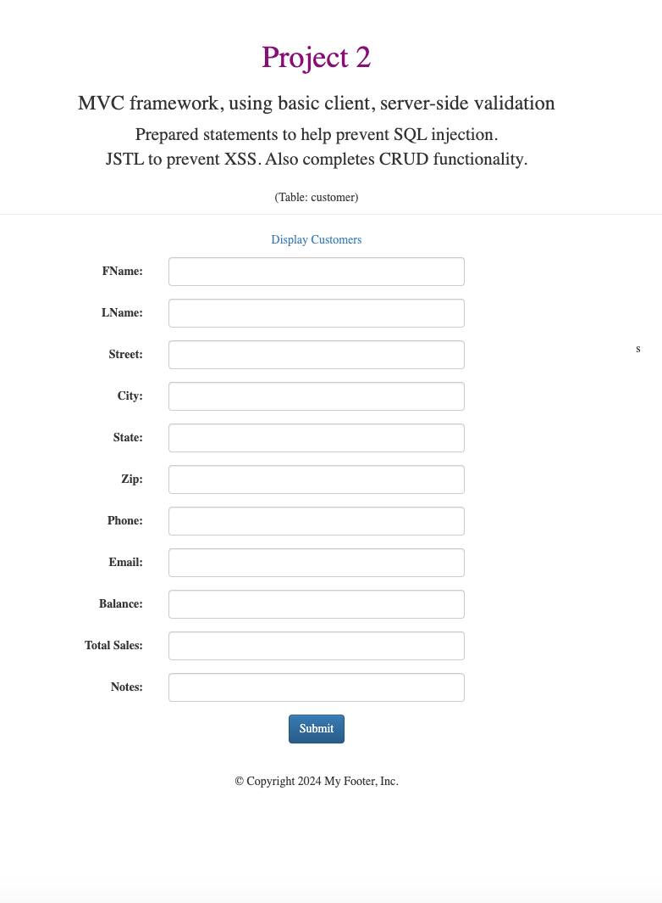
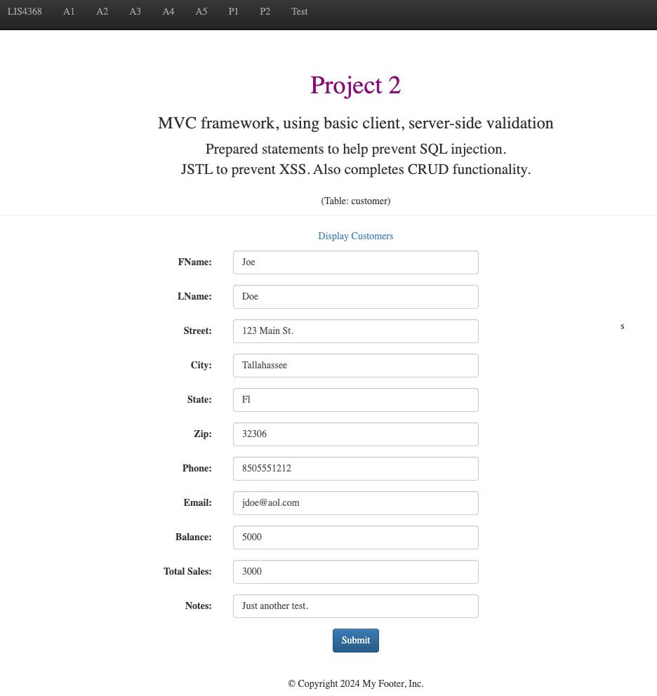
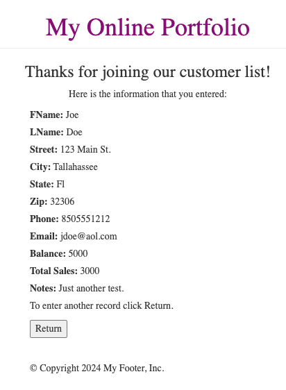
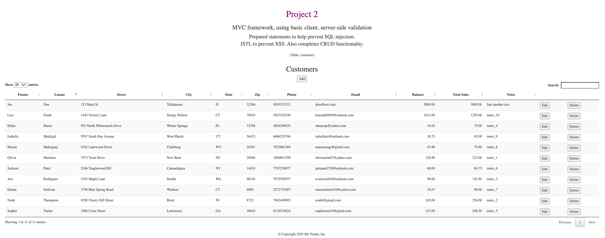
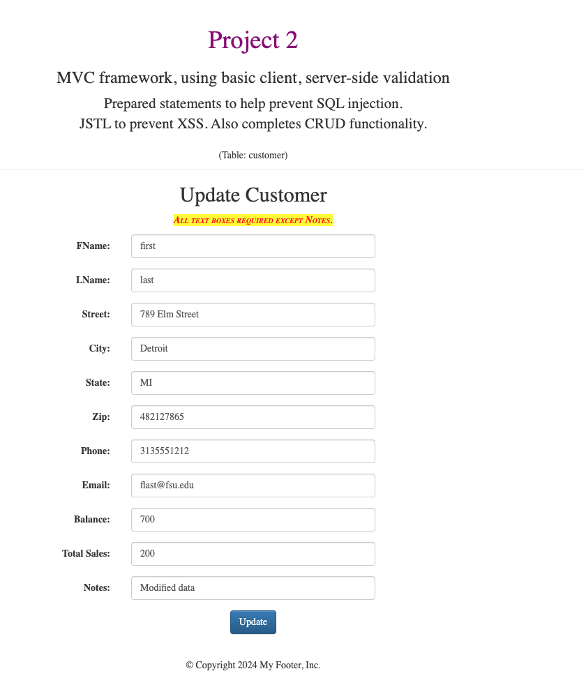
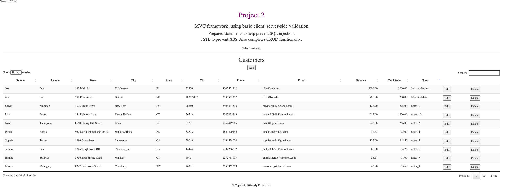
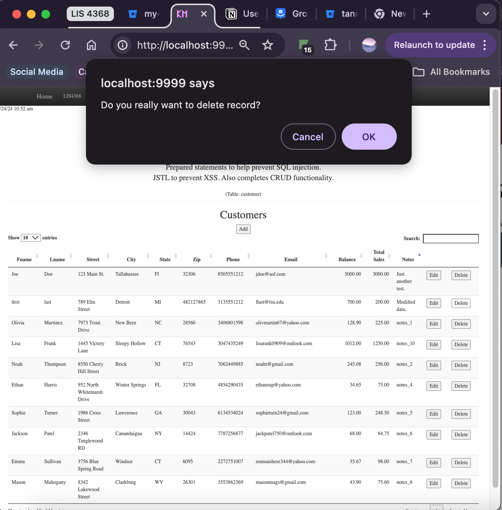
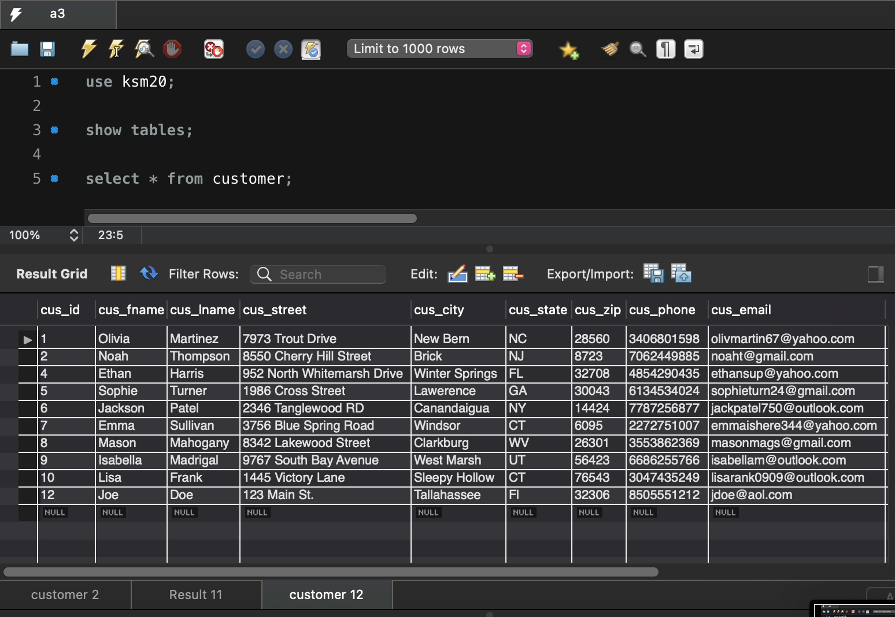
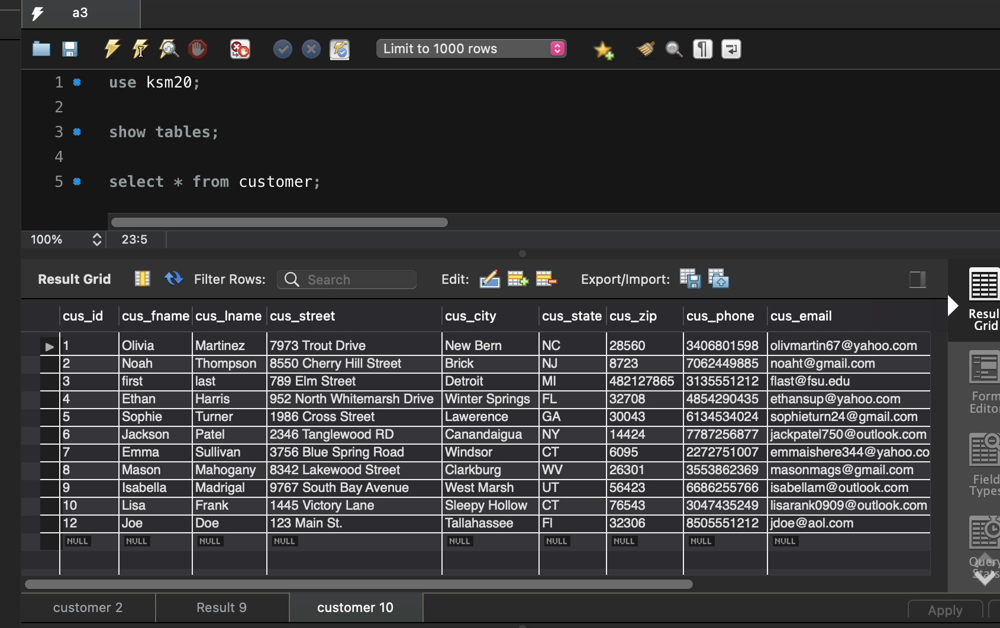
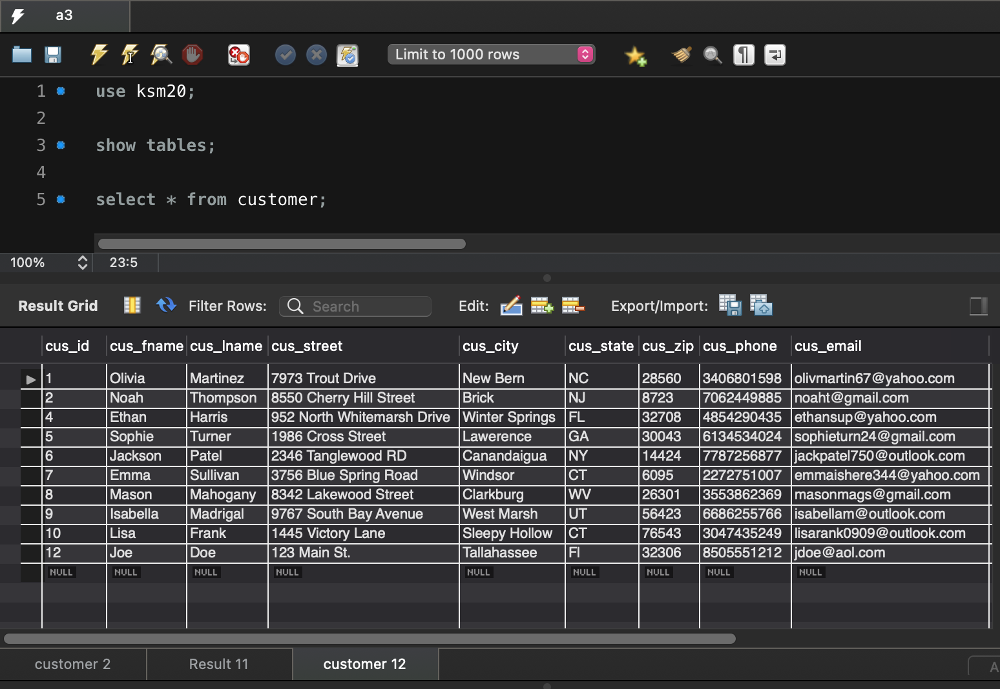

> **NOTE:** This README.md file should be placed at the **root of each of your repos directories.**
>
>Also, this file **must** use Markdown syntax, and provide project documentation as per below--otherwise, points **will** be deducted.
>

# LIS 4368

## Kalecia McNeal

### Project 2 Requirements:

*This includes:*

1. Fix validation for required files
2. Edit README.md
3. Provide required screenshots 
4. Answer questions from Ch 16 and 17. 

#### README.md file should include the following items:

* Screenshot of validation
* Screenshot of passed validation
* Screenshot of displaying data 
* Screenshots of modifying data 
* Screenshot of delete warning 
* Screenshots of associated database changes 

#### Assignment Screenshot and Links:

*Screenshot of valid entry form*:

*Screenshot of passed validation*:

*Screenshot of displaying data*:

*Screenshot of modifying form*:

*Screenshot of modified data*:

*Screenshot of delete warning*: 

*Screenshot of associated database changes (select, insert, update and delete)*: 

#### Links:

*Bitbucket Tutorial - Station Locations:*
[Bitbucket Station Locations Link](https://Apples24824@bitbucket.org/my-web-portfolio/bitbucketstationlocations.git "Bitbucket Station Locations")

*Regular Expressions*: 
[Lesson 7 - Regular Expressions](http://www.qcitr.com/usefullinks.htm#lesson7 "Dr. Jowett's Regular Expressions")

*My Online Portfolio Website*: 
[My Online Portfolio Link](http://localhost:9999/lis4368/index.jsp "My Online Portfolio")
